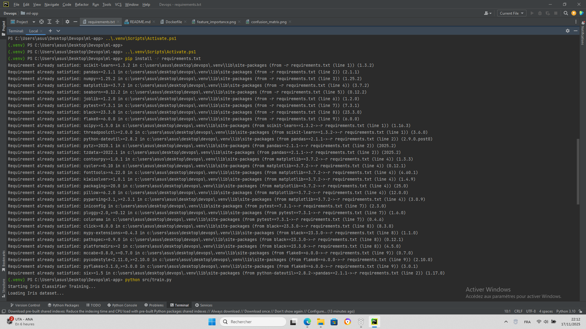
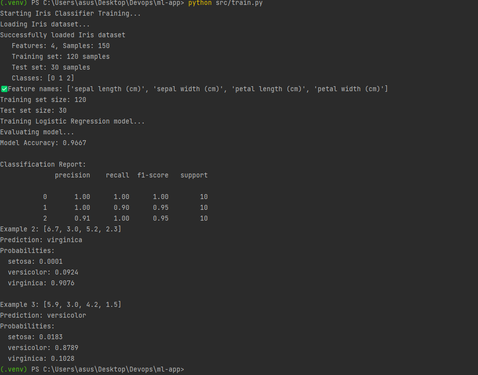
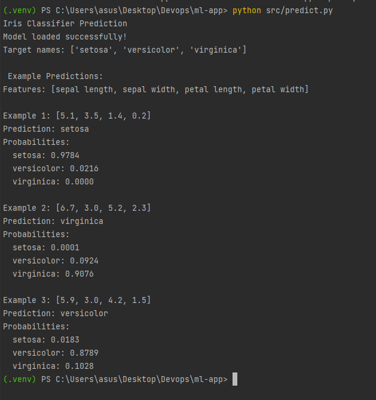
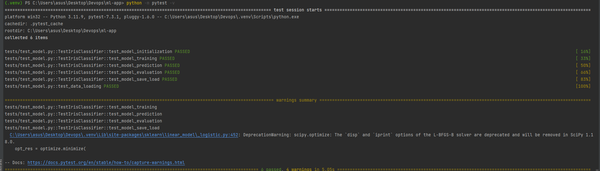
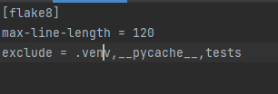
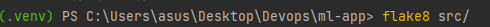
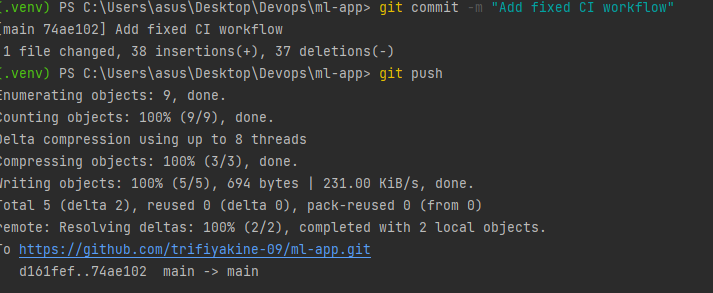
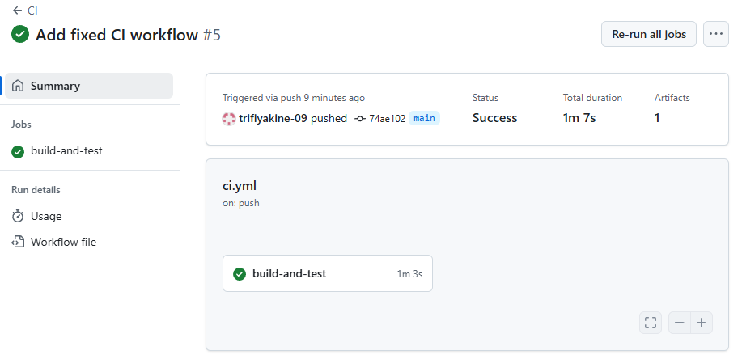
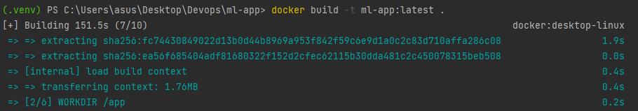
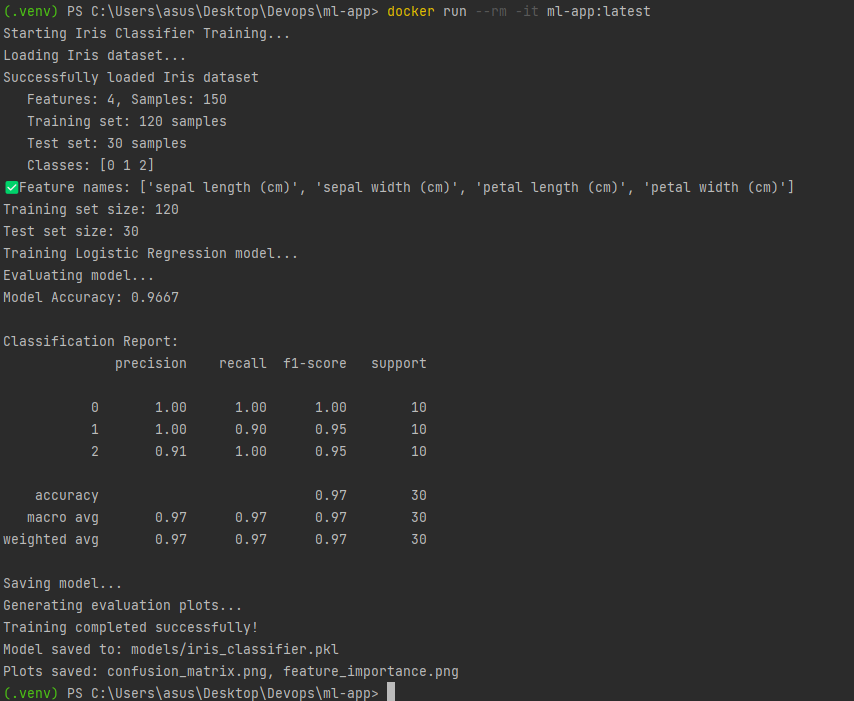

# DevOps Assignment Report

## Task 1: Prepare the ML Project
- Instead of forking the repo, I downloaded the ZIP of the source repo,added to it the Dockerfile file and created my own repository `ml-app` on GitHub.
- The project structure includes:
  - src/: Python scripts (train.py, predict.py, model.py, utils.py, data_loader.py)
  - requirements.txt: dependencies for the project
  - Dockerfile: added to containerize the app
  - tests
## Task 2: Run the ML Scripts
1. Activated virtual environment
   - Windows: `.\.venv\Scripts\Activate.ps1`
2. Installed dependencies: `pip install -r requirements.txt`
   
3. Trained the model:
   - Command: `python src/train.py`
   - Output: model trained, accuracy 0.9667, example prediction: [6.7, 3.0, 5.2, 2.3] → virginica
   
4. Made predictions:
   - Command: `python src/predict.py`
   - Output: example predictions printed
    
## Task 3: Unit Tests

- The `tests/test_model.py` file contains meaningful pytest tests for core ML functionality:
  1. Model initialization
  2. Model training
  3. Model prediction
  4. Model evaluation
  5. Save/load model
  6. Data loading
- Ran locally using: `python -m pytest tests/ --rootdir=.`
- Output: all 6 tests passed (see screenshot)
- Note: There were some warnings from sklearn regarding L-BFGS-B solver, which do not affect test results.
    
## Task 4: Linting & Formatting

To ensure code quality and maintainability, we added **flake8** as a linter for the project.

- Configuration
A minimal `.flake8` configuration file was created:
    
    **max-line-length**: Allows lines up to 120 characters.
    **exclude**: Ignores virtual environment, cache files, and test folder.
- Running Flake8
To run the linter, use:
    
- The screenshot below shows the `flake8` linting results after fixing issues:
    

## Task 5: GitHub Actions CI Workflow

For Task 5, we implemented a Continuous Integration (CI) workflow using GitHub Actions to automate testing, linting, and Docker build.

### Steps Taken:

1. **Folder & File Creation**
   - Created `.github/workflows/ci.yml` in the project root.
   - This file defines the CI pipeline that runs on `push` and `pull_request` events.
        
2. **Workflow Configuration**
   - The workflow performs the following tasks:
     - Checks out the repository code using `actions/checkout`.
     - Sets up Python using `actions/setup-python`.
     - Installs project dependencies from `requirements.txt`.
     - Runs `flake8` to check code style and linting issues.
     - Runs pytest tests and saves test results as artifacts.
     - Builds a Docker image of the ML app and uploads it as an artifact for later use.

3. **CI Benefits**
   - Automatically validates code on every push or pull request.
   - Ensures that tests pass and code style is maintained.
   - Provides reproducible Docker builds for deployment or sharing.

### Screenshot / Result

## Task 6: Containerise the App

In Task 6, we containerised the Iris ML application using Docker. This allows running the training script in a reproducible environment and isolates dependencies from the host machine.

### Steps Taken:

1. **Dockerfile already Created**

2. **Docker Build**
   - Built the Docker image locally using:  
     
   - This created an image `ml-app:latest` with all dependencies installed and code copied.

3. **Docker Run**
   - The container was run using:  
     
   - Training ran successfully inside the container, producing:
     - `models/iris_classifier.pkl`
     - `confusion_matrix.png`
     - `feature_importance.png`

4. **Benefits of Containerisation**
   - Provides a **reproducible environment**, independent of host Python version.
   - Isolates project dependencies.
   - Makes it easy to deploy the application in other environments or CI/CD pipelines.
   - Works seamlessly with GitHub Actions CI workflow for automated builds.

